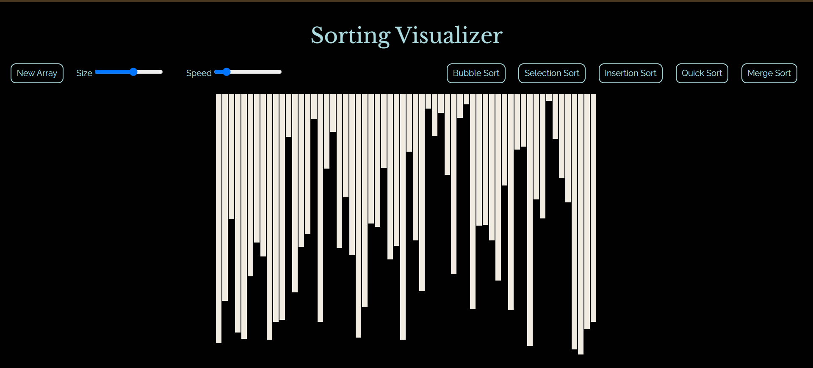

# Sorting Visualizer

A web-based sorting visualizer to help users understand different sorting algorithms through interactive visualizations.

## Demo
Check out a live demo of the project [here](https://ssali07.github.io/Sorting-Visualizer/).

[](https://ssali07.github.io/Sorting-Visualizer/)

## Features
- Visualizes common sorting algorithms such as:
  - Bubble Sort
  - Selection Sort
  - Insertion Sort
  - Merge Sort
  - Quick Sort
- Adjustable speed for the sorting visualization.
- User-friendly interface to select different sorting algorithms.
- Real-time updates of the sorting process using HTML elements.

## Technologies Used
- **Frontend**: HTML, CSS, JavaScript
- **Visualization**: HTML elements (like `div` elements styled as bars) are used to represent the data being sorted.
- **Libraries**: Bootstrap 5 for styling and layout.

## Getting Started

### Prerequisites
To run this project locally, you need:
- A web browser that supports modern JavaScript features.

### Installation
1. Clone the repository:
   ```bash
   git clone https://github.com/ssali07/Sorting-Visualizer.git
